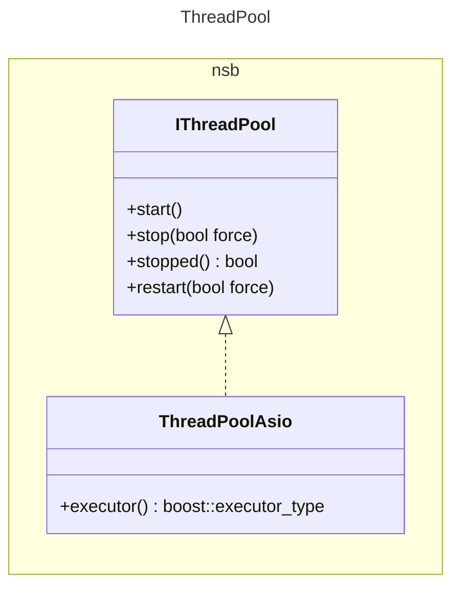
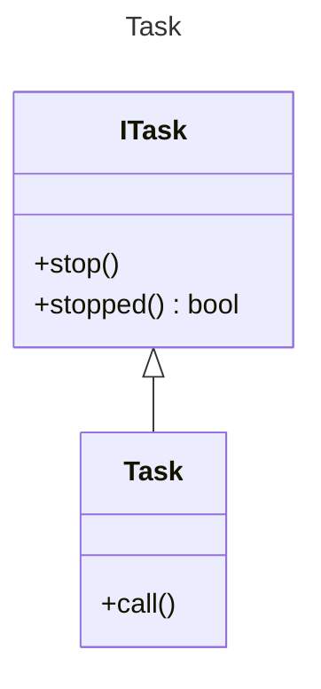
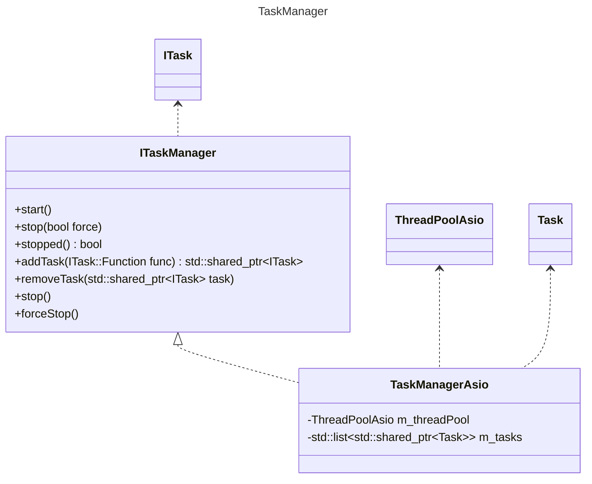

### UML class diagram

```mermaid
---
title: ThreadPool
---
classDiagram
direction LR

IThreadPool <|.. ThreadPoolAsio

namespace nsb {

class IThreadPool {
  +start()
  +stop(bool force)
  +stopped() bool
  +restart(bool force)
}

class ThreadPoolAsio {
  +executor() boost::executor_type
}

}
```

---

```mermaid
---
title: Task
---
classDiagram

ITask <|-- Task

class ITask {
  +stop()
  +stopped() bool
}

class Task {
  +call()
}

```

---

```mermaid
---
title: TaskManager
---
classDiagram

ITask          <.. ITaskManager
ITaskManager   <|.. TaskManagerAsio
ThreadPoolAsio <.. TaskManagerAsio
Task           <.. TaskManagerAsio


class ITaskManager{
  +start()
  +stop(bool force)
  +stopped() bool

  +addTask(ITask::Function func) std::shared_ptr~ITask~
  +removeTask(std::shared_ptr~ITask~ task)

  +stop()
  +forceStop()
}

class TaskManagerAsio {
  -ThreadPoolAsio m_threadPool
  -std::list~std::shared_ptr~Task~~ m_tasks
}

```
